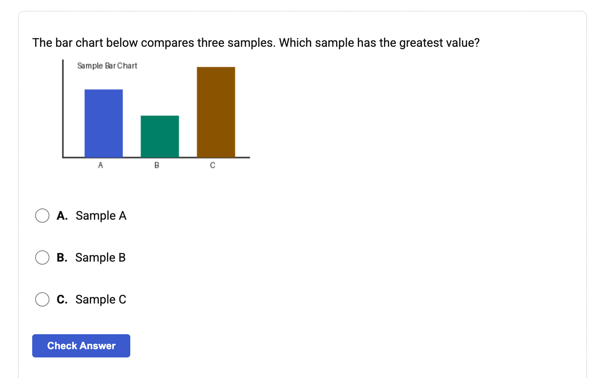
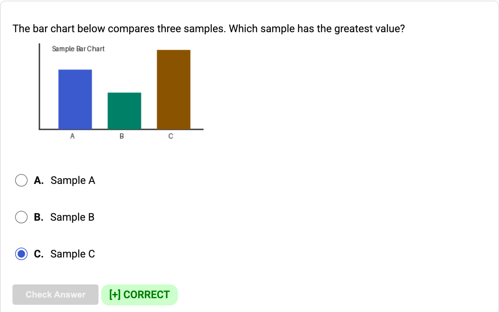

# QTI Package Maker

Converts question banks into portable LMS packages and standalone teaching formats, so instructors
can move assessments between Blackboard, Canvas, and Moodle without rebuilding questions or losing
embedded images.

**Write the bank once. Deliver it wherever students need it.** One source can become an LMS import,
a readable review copy, a printable exam source, or a self-grading web quiz.

## One bank, many destinations

| Destination | What you get | Best for | Image handling |
| --- | --- | --- | --- |
| Canvas and LibreTexts ADAPT | QTI 1.2 ZIP | Course imports | Packaged in the ZIP |
| Blackboard Learn and Ultra | QTI 2.1 or pool ZIP | Course and pool imports | Packaged in the ZIP |
| Any modern browser | One self-contained HTML file | Practice and review | Inlined in the HTML |
| Moodle, print, and text workflows | Aiken, exam YAML, and readable text | Reuse outside QTI | Referenced or described |

Blackboard image imports are backed by real Learn and Ultra sandbox probes. Canvas package structure
and image references pass automated checks, but live Canvas image rendering remains unverified because
the public Free for Teacher sandbox was discontinued. See
[docs/ENGINES.md](docs/ENGINES.md) for the complete compatibility matrix and exact limitations.

## See the bank teach itself

<!-- screenshots:begin (managed by screenshot-docs) -->



<!-- screenshots:end -->

The first image shows the ready-to-answer state; the second shows the same item after a correct
response. The same question bank that produces an LMS package can also produce this portable quiz:
no server, account, or external image folder required.

## Why instructors use it

- Move questions among Blackboard, Canvas, Moodle, and LibreTexts ADAPT workflows.
- Preserve embedded PNG, JPEG, and GIF figures in packaged LMS exports.
- Cover seven assessment types, from multiple choice to matching and ordered lists.
- Review content as readable text before importing it into a course.
- Publish a self-contained HTML practice quiz with instant grading.
- Use the command line for conversions or the Python API for generated question banks.

## Quick start

Requires Python 3.10 or newer; tested with Python 3.12. From a fresh checkout:

```sh
git clone https://github.com/vosslab/qti_package_maker.git
cd qti_package_maker
python3.12 -m venv .venv
source .venv/bin/activate
python -m pip install -r pip_requirements.txt
source source_me.sh
printf 'MC\tWhat color is a clear sky?\tblue\tcorrect\tgreen\tincorrect\n' > bbq-demo-questions.txt
python tools/bbq_converter.py -i bbq-demo-questions.txt -1 -r -s
```

This converts one Blackboard question-upload row into three useful artifacts:

- `qti12-demo.zip`: a Canvas QTI 1.2 import package.
- `human-demo.html`: a readable review copy.
- `selftest-demo.html`: a self-contained, self-grading quiz.

Input rows are tab-delimited, and input filenames follow `bbq-<name>-questions.txt`. The complete
installation paths, including virtual environments and PyPI, are in
[docs/INSTALL.md](docs/INSTALL.md).

## Choose an output

Select one or more outputs in the same conversion:

```sh
python tools/bbq_converter.py -i bbq-demo-questions.txt \
	-f canvas_qti_v1_2 -f blackboard_qti_v2_1 -f html_selftest
```

Use `-a` to select every CLI output or `python tools/bbq_converter.py -h` to see the available
shortcuts. Some specialized engines are API-only; [docs/USAGE.md](docs/USAGE.md) covers the full CLI
and Python API, while [docs/FORMATS.md](docs/FORMATS.md) defines inputs and outputs.

## Use it from Python

Build a mixed question bank directly when the source is generated rather than stored in a text file:

```python
from qti_package_maker import package_interface

bank = package_interface.QTIPackageInterface("bio101", allow_mixed=True)
bank.add_item("MC", ("What color is a clear sky?", ["blue", "green"], "blue"))
bank.add_item("MA", ("Which are primes?", ["2", "3", "4"], ["2", "3"]))
bank.save_package("canvas_qti_v1_2", "bio101.zip")
```

The result is a Canvas-ready QTI ZIP built through the same engine used by the command-line workflow.

## Documentation

Start here:

- [docs/INSTALL.md](docs/INSTALL.md): Setup, dependencies, and installation choices.
- [docs/USAGE.md](docs/USAGE.md): CLI commands, Python API, images, and worked examples.
- [docs/ENGINES.md](docs/ENGINES.md): Complete engine, question-type, and media compatibility tables.
- [docs/TROUBLESHOOTING.md](docs/TROUBLESHOOTING.md): Symptoms, error messages, and fixes.

Go deeper:

- [docs/FORMATS.md](docs/FORMATS.md): Supported input and output formats.
- [docs/QUESTION_TYPES.md](docs/QUESTION_TYPES.md): Fields for all seven assessment types.
- [docs/CODE_ARCHITECTURE.md](docs/CODE_ARCHITECTURE.md): Reader, item-bank, and writer data flow.
- [docs/FILE_STRUCTURE.md](docs/FILE_STRUCTURE.md): Repository layout and generated artifacts.

## Project status

The project is beta software. Runtime modules require Python 3.10 or newer, while the development
and test environment targets Python 3.12. Blackboard Learn and Ultra image paths have live-import
evidence; Canvas image packaging follows the QTI structure and passes local integrity tests, but
still needs verification in an institutional Canvas sandbox.

## License

Code is licensed under the GNU Lesser General Public License v3. See
[LICENSE.LGPL_v3](LICENSE.LGPL_v3).

## Author and support

Created by Neil Voss. Follow the work on
[Bluesky](https://bsky.app/profile/neilvosslab.bsky.social),
[YouTube](https://www.youtube.com/neilvosslab), or [GitHub](https://github.com/vosslab).

Support continued development through
[Patreon](https://www.patreon.com/vosslab), [PayPal](https://paypal.me/vosslab),
[Bitcoin](bitcoin:bc1qdexkqwzyet93ret40akqmms2jv99wvsgzdshu8?message=support%20qti_package_maker),
or [Dash](dash:XdDmwBVecEy9yyXKeD7hScLp7oN8rd4XNV?message=support%20qti_package_maker).
